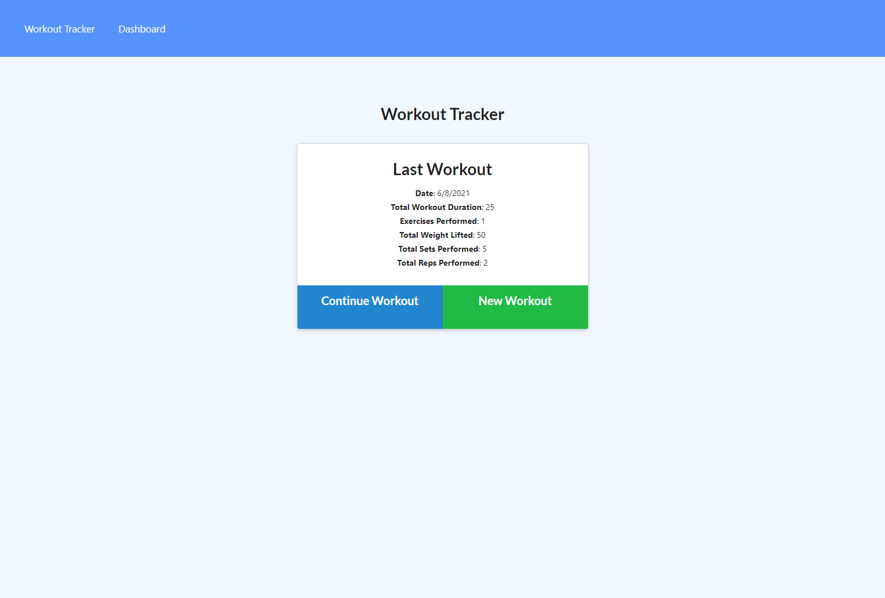
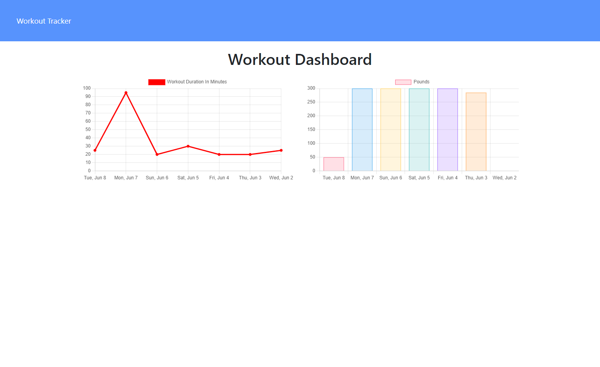
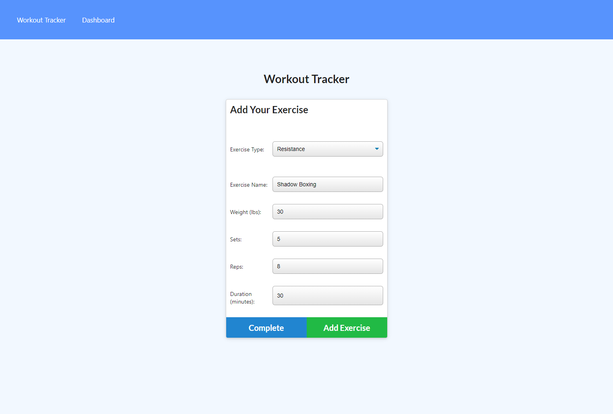

 

## **workout tracker** 
 

[https://damp-plains-35978.herokuapp.com/](https://damp-plains-35978.herokuapp.com/) 
 

## description

***
As a user, I want to be able to view create and track daily workouts. I want to be able to log multiple exercises in a workout on a given day. I should also be able to track the name, type, weight, sets, reps, and duration of exercise. If the exercise is a cardio exercise, I should be able to track my distance traveled. 
Workout Tracker answers these needs and presents an easy to use UI to keep track of daily physical exercises with graphs. This app utilizes Node.js, Express.js, MongoDB, Mongoose and Bootstrap. It was developed over front end starter code and deployed to Heroku through MongoDB Atlas.  
 
 

## acceptance criteria

***

The codebase achieves the following criteria: 

* The user should be able to: 

* Add exercises to the most recent workout plan. 

* Add new exercises to a new workout plan. 

* View the combined weight of multiple exercises from the past seven workouts on the `stats` page 

* View the total duration of each workout from the past seven workouts on the `stats` page. 
 
 

## usage

***

Screenshots that shows the full generated web page: 
 

 

 

 
 
 

## some valuable references

***

These notes and links are listing some valuable references among others that I used doing this homework: 
 

[https://docs.mongodb.com/manual/reference/operator/aggregation/addFields/](https://docs.mongodb.com/manual/reference/operator/aggregation/addFields/)

[https://docs.mongodb.com/manual/reference/operator/aggregation/sum/](https://docs.mongodb.com/manual/reference/operator/aggregation/sum/)

[https://mongoosejs.com/docs/api.html#aggregate_Aggregate](https://mongoosejs.com/docs/api.html#aggregate_Aggregate)

[https://docs.mongodb.com/manual/reference/operator/update/push/](https://docs.mongodb.com/manual/reference/operator/update/push/)

[https://kb.objectrocket.com/mongo-db/how-to-use-the-mongoose-limit-function-927](https://kb.objectrocket.com/mongo-db/how-to-use-the-mongoose-limit-function-927)

[https://www.mongodb.com/cloud/atlas](https://www.mongodb.com/cloud/atlas)

[https://expressjs.com/en/guide/writing-middleware.html](https://expressjs.com/en/guide/writing-middleware.html)

[https://shields.io/category/dependencies/](https://shields.io/category/dependencies/)

[https://www.screencastify.com/](https://www.screencastify.com/)

 
 

## credits

***

Stephen Woosley - Bootcamp Instructor 
Patrick Haberern - Bootcamp TA 
Tim Nagorski - Bootcamp TA 
Sean Walmer - Bootcamp TA 
Alexis San Javier - Bootcamp Tutor 
 
 

## license

***

This is an assigment done under a bootcamp program, it is public but please contact the publisher before you use or
change any content. 
ghibli.github@gmail.com
 
 

## badges

***

 
 
